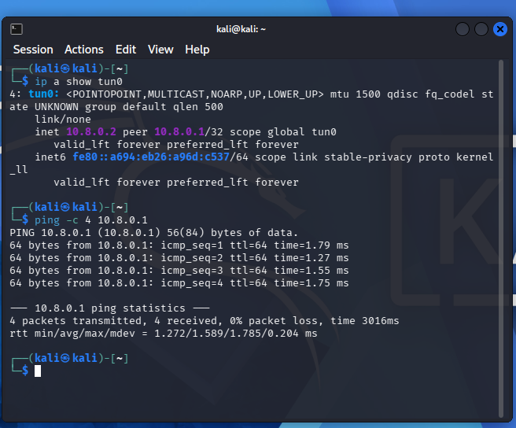
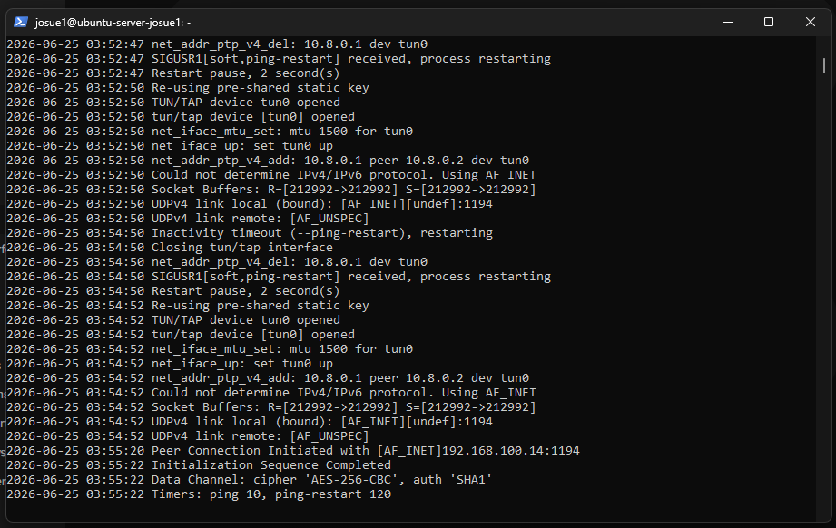

# 🔒 Configuración de VPN Punto a Punto con OpenVPN (Clave Estática)

Laboratorio práctico realizado como parte del curso **CIB-12 Seguridad en Redes** (Universidad Cenfotec). El objetivo fue implementar un túnel VPN punto a punto entre un servidor Ubuntu Server y un cliente Kali Linux, usando OpenVPN con autenticación por llave estática compartida (pre-shared key).

> ⚠️ **Entorno de laboratorio.** Configuración realizada en un entorno virtualizado con fines académicos.

## 👤 Estudiante

- Josué Monge

## 🎯 Objetivo del laboratorio

Configurar un enlace VPN seguro entre dos máquinas usando OpenVPN, entendiendo el rol de la criptografía simétrica estática y resolviendo los conflictos de compatibilidad que surgen al usar cifrados heredados sobre librerías criptográficas modernas (OpenSSL 3.x).

## 🛠️ Herramientas y tecnologías

- **Ubuntu Server** — máquina servidor
- **Kali Linux** — máquina cliente
- **OpenVPN** — solución VPN de código abierto
- **SSH** — administración remota del servidor
- **AES-256-CBC** — algoritmo de cifrado simétrico

## 📋 Metodología

### 1. Preparación y limpieza del servidor
Vía SSH, se detuvo y deshabilitó el servicio previo de OpenVPN y se limpió por completo el directorio de configuración, garantizando un despliegue libre de conflictos:

```bash
sudo systemctl stop openvpn@server && sudo systemctl disable openvpn@server
sudo rm -rf /etc/openvpn/*
```

### 2. Generación de material criptográfico
Se generó una llave estática compartida de alta entropía para el cifrado y autenticación del túnel:

```bash
sudo openvpn --genkey --secret /etc/openvpn/ta.key
```

### 3. Configuración del servidor
Durante la configuración surgió un problema de compatibilidad: las versiones recientes de OpenSSL (3.x) deshabilitan por defecto cifrados heredados como Blowfish, y el modo de clave estática no es compatible con cifrados AEAD modernos (como AES-256-GCM). La solución fue forzar el uso de **AES-256-CBC** junto con una bandera de compatibilidad explícita para criptografía estática heredada:

```conf
dev tun
port 1194
proto udp
ifconfig 10.8.0.1 10.8.0.2
secret /etc/openvpn/ta.key
allow-deprecated-insecure-static-crypto
cipher AES-256-CBC
data-ciphers AES-256-CBC
keepalive 10 120
status /var/log/openvpn-status.log
verb 3
```

### 4. Configuración del cliente (Kali Linux)
Se replicó la misma llave secreta en el cliente y se configuraron los parámetros de conexión apuntando a la IP y puerto del servidor:

```conf
dev tun
proto udp
remote 192.168.100.26 1194
ifconfig 10.8.0.2 10.8.0.1
secret /etc/openvpn/ta.key
allow-deprecated-insecure-static-crypto
cipher AES-256-CBC
data-ciphers AES-256-CBC
keepalive 10 120
verb 3
```

### 5. Verificación y pruebas
Se confirmó la creación de la interfaz virtual del túnel (`tun0`) y se validó la conectividad extremo a extremo mediante ICMP:

```bash
ip a show tun0
ping -c 4 10.8.0.1
```

**Resultado:** conexión estable, keepalive cada 10s con tolerancia de 120s, y **0% de pérdida de paquetes** en la prueba de ping.




## 🔎 Desafíos técnicos y solución de ingeniería

El reto principal del laboratorio fue la **incompatibilidad entre cifrados heredados y librerías criptográficas modernas**:

- Blowfish (BF-CBC) viene deshabilitado por defecto en OpenSSL 3.x por obsolescencia.
- El modo de clave estática de OpenVPN no es compatible con cifrados AEAD (como AES-256-GCM).
- **Solución:** usar AES-256-CBC (un cifrado de bloques robusto y aún soportado) junto con la directiva `allow-deprecated-insecure-static-crypto`, que le indica explícitamente a OpenVPN que acepte esta configuración criptográfica de transición.

## 📚 Aprendizajes clave

- Diferencia entre autenticación por **llave estática compartida** y esquemas basados en **PKI/certificados digitales**, y en qué escenarios usar cada uno.
- Por qué las actualizaciones de librerías criptográficas (como OpenSSL 3.x) pueden romper compatibilidad con configuraciones heredadas, y cómo diagnosticarlo.
- Ventajas de OpenVPN frente a alternativas como IPsec (opera en espacio de usuario, mejor evasión de firewalls/NAT) y WireGuard (mayor flexibilidad de autenticación y compatibilidad regresiva).
- Buenas prácticas de mantenimiento de una VPN en producción: rotación periódica de claves, monitoreo de logs de conexión y gestión de listas de revocación de certificados (CRL/OCSP).

---

📌 *Proyecto académico desarrollado para el curso de Seguridad en Redes — Universidad Cenfotec.*
